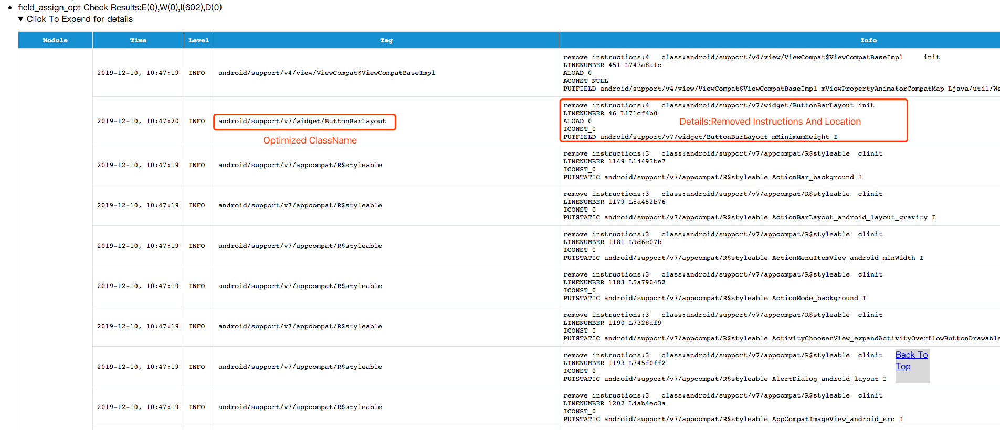

[English](README.md) | **[简体中文](README-zh.md)**
## 功能
&nbsp;&nbsp;&nbsp;&nbsp;&nbsp;&nbsp;编译期间去除代码中不必要或者重复的赋值(默认值)代码
## 原理
&nbsp;&nbsp;&nbsp;&nbsp;&nbsp;&nbsp;类中的字段(包含静态字段和成员字段)在虚拟机实例化时分配的内存中默认会给予默认值（[官方虚拟机规范](https://docs.oracle.com/javase/specs/jvms/se7/html/jvms-2.html#jvms-2.3)),但我们的开发也会写一些带默认值的字段，这些默认值赋值的指令将会在对应的构造方法(成员字段)或者类代码块(静态字段)中赋值，这些赋值是冗余的，插件将分析该类赋值指令，并对其进行优化.<br/>
&nbsp;&nbsp;&nbsp;&nbsp;&nbsp;&nbsp;优化的场景包含以下几种：

* 直接在声明字段的地方附上默认值

	```java
    private boolean aBoolean = false;
    private byte aByte = 0;
    private short aShort = 0;
    private char aChar = '\u0000';
    private int anInt = 0;
    private float aFloat = 0f;
    private double aDouble = 0d;
    private long aLong = 0l;
    private Object aObject = null;
	```
	
* 在构造方法/静态块中对成员字段/类字段进行默认值赋值代码.

	```java
    class MyTestClass{
        private static int sInt;
        private int mInt;
        static {
            sInt = 0;//delete
            sInt = 0;//delete
            sInt = 1;
            sInt = 0;//not delete
            sInt = 0;//not delete
        }
        public MyTestClass(Object any){
            this();
            mInt = 0;//not delete
            sInt = 0;//not delete
        }
        public MyTestClass(){
            mInt = 0;//delete
            mInt = 0;//delete
            mInt = 1;
            mInt = 0;//not delete
            mInt = 0;//not delete
            
            sInt = 0;//not delete
            sInt = 1;//not delete
        }
    }
	```
## 接入方式
* 添加插件classpath
  >classpath "com.bytedance.android.byteX:field-assign-opt-plugin:${plugin_version}"
* 在application的build.gradle中apply插件并配置

	```groovy
	apply plugin: 'bytex.field_assign_opt'
	field_assign_opt {
    	enable true
    	enableInDebug false
    	logLevel "INFO"
    	removeLineNumber true // 同时移除赋值对应的行号信息(如果有的话),默认true。
    	whiteList = [
        	//白名单，ClassName.FieldName 。不支持模式匹配
        	//"android.support.constraint.solver.ArrayRow.isSimpleDefinition"
    	]
	}
	```
## 优化效果
&nbsp;&nbsp;&nbsp;&nbsp;&nbsp;&nbsp;抖音减少8000+个冗余赋值，减少包体积约30KB<br/>
&nbsp;&nbsp;&nbsp;&nbsp;&nbsp;&nbsp;检查结果默认将会放在对应的`app/build/ByteX/ByteX_report_ByteX.html`中，类似下图:<br/>
