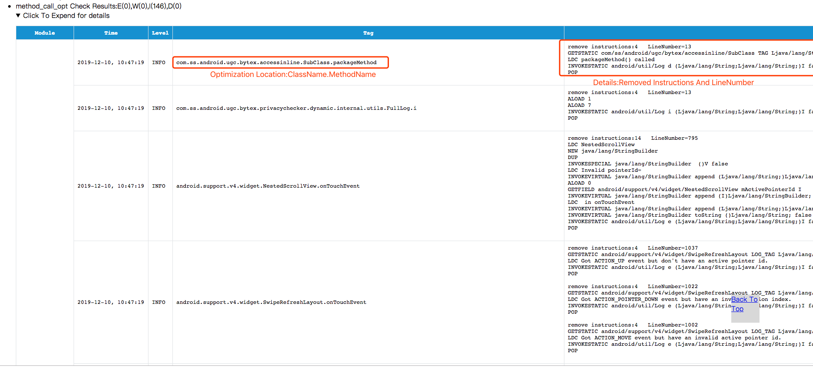

**[English](README.md)** | [简体中文](README-zh.md)
## Feature
&nbsp;&nbsp;&nbsp;&nbsp;&nbsp;&nbsp;According to the configuration, all the method calls (including parameters's instructions) configured in the configuration are optimized during the compilation of the project.

For Example：
```java
public class Example {
    private void test() {
        //do something
        try{
            Log.d("Example","startString"+new StringBuilder().append("thisone").append("thatone").append(this.getClass().getName()).append("\n")+"endString");
        }catch (Exception e){
            Logger.e(e);
        }
        //do something
    }
}

//after optimization
//Log.d and Logger.e need be configured in pulgin's extensin
public class Example {
    private void test() {
        //do something
        try{
        }catch (Exception e){
        }
        //do something
    }
}

``` 
## Why not use Proguard
You can configure `-assumenosideeffects` in proguard rules to shrink invalid calls, but the principle is to delete the call instruction and then use pop to balance the operand stack . But the problem is the instructions that generate method's parameters will be left behind. The same example code above, If you use proguard, the effect will be as follows:
```java
public class Example {
    private void test() {
        //do something
        try{
            //此处特意把LDC的常量显示出来是因为优化本来会留下这些符号，这个可以再叠加其他指令优化做到删除。反编译apk依然能看到这些参数信息的代码。
            "Example";
            "startString"+new StringBuilder().append("thisonee").append("thatone").append(this.getClass().getName()).append("\n")+"endString";
        }catch (Exception e){
            e;
            
        }
        //do something
    }
}

```
## Quick Start
* add build classpath

  >classpath "com.bytedance.android.byteX:method-call-opt-plugin:${plugin_version}"
* apply and configure the plugin in your build.gradle(application)

	```groovy
	apply plugin: 'bytex.method_call_opt'
	method_call_opt {
    	enable true //false is recommended in development mode
    	enableInDebug false
    	logLevel "DEBUG"
    	//Show optimized instructions of the method  in the log.false is recommended
    	showAfterOptInsLog false
    	//methods which need to be optimized
    	methodList = [
            //class#method#desc
            "android/util/Log#v#(Ljava/lang/String;Ljava/lang/String;)I",
            "android/util/Log#v#(Ljava/lang/String;Ljava/lang/String;Ljava/lang/Throwable;)I",
            "android/util/Log#d#(Ljava/lang/String;Ljava/lang/String;)I",
            "android/util/Log#d#(Ljava/lang/String;Ljava/lang/String;Ljava/lang/Throwable;)I",
            "android/util/Log#i#(Ljava/lang/String;Ljava/lang/String;)I",
            "android/util/Log#i#(Ljava/lang/String;Ljava/lang/String;Ljava/lang/Throwable;)I",
            "android/util/Log#w#(Ljava/lang/String;Ljava/lang/String;)I",
            "android/util/Log#w#(Ljava/lang/String;Ljava/lang/String;Ljava/lang/Throwable;)I",
            "android/util/Log#e#(Ljava/lang/String;Ljava/lang/String;)I",
            "android/util/Log#e#(Ljava/lang/String;Ljava/lang/String;Ljava/lang/Throwable;)I",
            "android/util/Log#println#(ILjava/lang/String;Ljava/lang/String;)I",

            "java/lang/Throwable#printStackTrace#()V",
            "com/google/devtools/build/android/desugar/runtime/ThrowableExtension#printStackTrace#(Ljava/lang/Throwable;)V"
            
            //other methods according to your project
    	]
    	onlyCheckList = [
            //"com/ss/*",
            //"com/bytedance/*"
    	]

    	whiteList = [
            "com/facebook/stetho*",
    	]
	}
	```
	
##  Optimizing results
&nbsp;&nbsp;&nbsp;&nbsp;&nbsp;&nbsp;More than 12000+ method calls are cut down from Douyin apk, resulting in 200KB slimmer than not(If Kotlin's null checker is configured , there will be another 300KB optimization)<br/>
&nbsp;&nbsp;&nbsp;&nbsp;&nbsp;&nbsp;The optimized result will be printed into the corresponding `app/build/ByteX/ByteX_report_ByteX.html` by default，Records optimized instructions。The result may look like the picture showed below:<br/>

&nbsp;&nbsp;&nbsp;&nbsp;&nbsp;&nbsp;**Note**:If there is a jump instruction between the beginning and the ending of a method call,the plugin will skip optimization。

## Principle
&nbsp;&nbsp;&nbsp;&nbsp;&nbsp;&nbsp;Search for both the beginning and the ending of a method call (a complete code method) and remove the instructions in this section.<br/>
&nbsp;&nbsp;&nbsp;&nbsp;&nbsp;&nbsp;The instruction at the beginning of the method is the instruction corresponding to the first parameter of the method into the operand stack, and the instruction at the end of the method is the instruction position where the method return value（It is possible that there is no return value） out of the operand stack.;**Note**: If the return value is not popped by POP or POP2, it means that the return value of the called method is used other instructions. In order to ensure the correctness of the optmization, the plugin handles this situation by skipping the optimization, so The ending instruction here must be pop / pop2 if there is a return value or a method call instruction there is no return value.<br/>
&nbsp;&nbsp;&nbsp;&nbsp;&nbsp;&nbsp;We should to know a few points about java compilation:

* A complete java method call code will be compiled into one or more consecutive bytecode instructions
* Java bytecode instructions are designed based on the stack
* Each bytecode instruction may correspond to several pops and pushes of the operand stack
* The operand stack is the same before and after a complete standalone code / code block is executed

>Note:point 4 can be proved anyway by contradiction<br/>
>&nbsp;&nbsp;&nbsp;&nbsp;&nbsp;&nbsp;Suppose there is more operand stack before a complete independent code / code block is executed than after execution, then suppose i write the same code multiple times (such as in a for loop loop) in our codes, there must be a stack overflow in the operand stack and then where is a crash.<br/>
>&nbsp;&nbsp;&nbsp;&nbsp;&nbsp;&nbsp;Suppose that before a complete independent code / code block is executed, the operand stack becomes smaller than after execution, then suppose i write the same code multiple times (such as in a for loop loop) in our codes, the operand stack must exist on the stack become negative and then where is a crash<br/>

&nbsp;&nbsp;&nbsp;&nbsp;&nbsp;&nbsp;We need to find the start instruction and end instruction of a method call. The length of this instruction is indefinite, so here we reverse the start and end according to the principle of the stack.<br/>

### Steps
* Find the location of the method call instruction that needs to be optimized when traversing all instructions in the project
* Define two objects of data type as stack: inStack and outStack
* Calculate how many operands need to be pushed out while invoke the optimized method and put them into inStack; Calculate how many operands need to be pushed while invoke the optimized method and put these operands into outStack;
* If the inStack is not empty, look up the instruction that is pushed into the stack, then analyze the stack of the instruction and add the instack that needs to be analyzed. Instruction position.
* For the instruction to find the pop-out instruction when the outStack is not empty, the pop-up instruction must be pop / pop2, otherwise skip the optimization and continue to perform this step until outStack is empty, which is the position of the method call end instruction.
* For the calculated startIndex, because of the optimization, there will be a problem that there is no valid instruction between the two frame attributes, which will cause a verification exception while asm writes bytecode to the class. So,we should delete the Frame before startIndex.

